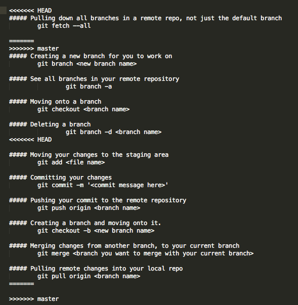

# Learn git

This workshop has been made for students of [Founders and Coders](www.founderandcoders.com), and therefore assumes that you have completed lesson 1 of [Udacity's Git and GitHub course](https://www.udacity.com/course/how-to-use-git-and-github--ud775) (as part of the [precourse material](https://github.com/foundersandcoders/master-reference/tree/master/coursebook/precourse))

**All contributions to this workshop are very welcome!** If you have any suggestions for improvements, please raise an [issue](https://github.com/NataliaLKB/learn-git-basics/issues). [Pull requests](https://github.com/jsms90/learn-git-basics/pulls) are also very much appreciated, but please follow the [contributing guidelines](https://github.com/foundersandcoders/master-reference/blob/master/CONTRIBUTING.md).

# Contents
1. [Introducing Github Flow](#github-flow)
2. [Tutorial](#tutorial)
  + [Getting Started](#getting-started)
  + [Branching](#branching)
  + [Making Changes](#changes)
  + [Merging with Master](#merging)
  + [Merge Conflicts](#conflicts)
  + [Changing File Structure](#changing-file-structure)

3. [Git for Collaboration](#git-collaboration)
  + [Terminology](#terminology)
  + [The Timeline](#timeline)

4. [Resources](#resources)

<a name="github-flow" id="github-flow"></a>
## GitHub Flow
Start by brushing up on the basic [GitHub workflow](https://guides.github.com/introduction/flow/)

**Branches**  
As you work on a git repo the first branch you are on is usually the default branch. This is called `master`. If you start working on a section of the website (say the footer styling), it is best practise to create your own branch for that feature. Creating your own branch is like taking a copy of `master` and renaming it. When you commit, they will now be on that new branch only.


**Multiple people working on the same files**  
Version control makes this possible. If you work on one file, and then I work on the same file at the same time when we want to combine our changes git allows us to keep both versions save that we can compare. This allows us to integrate our changes more swiftly.

<a name="tutorial" id="tutorial"></a>
## Tutorial

Next please fork this repository.


<a name="getting-started" id="getting-started"></a>
### Getting Started
The next step is to clone the forked version of this repository. On the main page of the repo, copy the url shown here:


Then use the command in your terminal:

```
git clone https://github.com/NataliaLKB/learn-git-basics.git
```

You should now be able to redirect into the directory just created using the command line.

Next, it is good to get in the habit after each command to use `git status`. Let us use it now.

```
git status
```

Now check which branch you are on:

```
git branch
```

You should only see `master` which is the default branch in this repo.

When there are other branches in your repo the green branch is the current one you are on.


<a name="branching" id="branching"></a>
### Branching
The next step is to create your own branch to work on. try this:

```
git branch new-branch
```

It is best to try to name your branches as specific as possible, so not to confuse them with any others. There are many naming conventions out there for branches, but for this week simply try to name them off of a feature. For example (`navbar-collapse` or `sass-file-structure`). To see all your branches:

```
git branch
```

As you can see, you have created your branch, but are not currently on it. To navigate onto it please:

```
git checkout new-branch
git branch
```

Now you can see you are on that branch. Go back to master and now we are going to delete `new-branch`.

```
git checkout master
git branch -d new-branch
git branch
```

As you can see, your branch is now gone.


<a name="changes" id="changes"></a>
### Making Changes
Now it is time to make some changes in the project. Make yourself a new branch named `update-cheatsheet` and go onto it. open up the file cheatsheet.md in your favourite text editor.

As you can see, this contains all the commands you will need to begin using git. Continue to add to it all the new commands you learn. To begin, here is a command that both creates a branch, and moves you onto it at the same time:

```
git checkout -b <new branch name>
```

Add that command, and its description to cheatsheet.md and save it. Now in your terminal:

```
git status
```

You will see something like this:


You will see your changes in red. now we need to add them to the git staging area. Doing this is like telling git to pay attention to these files, and start tracking the changes. To do this write this command:

```
git add cheatsheet.md
git status
```

Now you can see the file name has turned green. Now to commit your changes.

```
git commit -m 'adding new command in the cheatsheet'
git status
```

The message could be anything, but it is best to make it something that describes what you just did. You can also use the command `git commit` without `-m '<message'`, however beware that it will send you to a text editor called Vim. Though learning how to use Vim is important, it isn't necessary at this stage. Typing `:q` straight away will get you out of it and commit again with a message.


<a name="merging" id="merging"></a>
### Merging Changes with Master
Now that you have made and committed your changes, it is time to merge your branch with master. Even though you are not working with anyone else on this repository, it is always good practice to make sure your current branch is completely up to date with master. Imagine if you were working with a team. Someone else has already pushed up changes to master. If that someone else and yourself have changed the same file, it is quite likely that your changes will not be compatible with theirs. To avoid this, you want to merge your changes with theirs to avoid future problems. Checkout back onto master and pull down. These commands look like this:

```
git checkout master
git pull origin master
```

Pulling down means that you are getting any recent changes from the remote master branch which is located in Github. Next go back to your branch (`update-cheatsheet`)  and merge with master.

```
git merge master
```

Even though in this situation there isn't any changes to merge, it is best to get in the habit on going through these steps in your work flow. Merging like this means taking any possible changes in master and merging them with the branch you are currently on.
After you merge with master you have to push your changes to the remote repo (Github).

```
git push origin update-cheatsheet
```

When you pull or push you are referring to your remote repo, or origin. In the example of `git push origin <branch name>` you are pushing your local changes to a remote branch that you are both creating, and naming. Since you are creating this branch from your local one it makes things much simpler if you use the same name for your remote branch, as your local one.

For more information on pushing, see [here](https://help.github.com/articles/pushing-to-a-remote/)

Go to your browser and open up this repository in github. Press the branches button


And then make a pull request  to master


Afterwards you will see a merge button. Press it and delete your branch. Now your remote branch master is completely up to date with your latest changes.

Return to your terminal and navigate to your local master branch. Pull down. You will see your branch update (fast-forward). Delete the branch `update-cheatsheet`.


<a name="conflicts" id="conflicts"></a>
### Merge Conflicts
Check all the branches on this repository, even the remote ones. To do this use this command:

```
git branch -a
```

You should see something like this:


Run the command:

```
git checkout merging-experiments
```

Open up the git cheatsheet, as you can see there are some differences between this and master. To see these differences use command:

```
git diff master
```

The differences in green and the additions on this branch, that don't exist on master. The red are the things that are on master, that don't exist on this branch.

Merge with master. You should have a git conflict that looks something like this:



Do you see the lines at the top. The first section is labelled `HEAD` those are from this branch. The next section is from master. Delete the lines, and any other code you want until the cheatsheet looks like how you want it to look.

Afterwards git status, add the files in red, commit, and push. Then make a pull request to master like before and merge. Don't forget to update your local master branch, and delete the merged branch in Github and in your local repo. It is good to keep your working environments clean and organised.


<a id="changing-file-structure" name="changing-file-structure"></a>
### Changing File Structure
Imagine you're working on a project that's getting bigger in size. As new files are added, it makes sense to group some of them into folders. For example, it's a good idea to keep all CSS files in one folder, JS files in another etc.

Let's assume you've just cloned a repository structured like this:
```
index.html
stylesheet.css
script.js
```

However, you'd prefer to split these into folders like:
```
css/stylesheet.css
js/script.js
index.html
```

In order to achieve this, `git mv` command comes in handy. Using it to move files *ensures preserving history* of the files you work on. To change file structure like above (and create new folders at the same time) use command:
```
mkdir css && git mv stylesheet.css ./css
mkdir js && git mv script.js ./js
```
(This glues `mkdir` and `git mv` commands together with `&&` operator).

Basic function usage is
```
git mv <source> <destination>
```
The command also takes optional parameters. To find out more, refer to [documentation](http://git-scm.com/docs/git-mv).


<a name="git-collaboration" id="git-collaboration"></a>
# Git for Collaboration

<a name="terminology" id="terminology"></a>
## Terminology

##### Commit Hash:


##### HEAD
Simply put, the HEAD is a reference to a commit object. For more information see: http://eagain.net/articles/git-for-computer-scientists/


<a name="timeline" id="timeline"></a>
## The Timeline

As you know from the Udacity course, git stores all the commits on the project. You can use them as a timeline and travel back and forth in time. This section reminds you how to do that, which will come in handy as you work in projects with your team.

Make a new branch called `timeline-practice` and navigate onto it.

Step 1) Make a new directory in the project via the command line. Lets call it `time`.

```
mkdir time
```

Step 2) Also make a new file in that directory and call it whatever you like. A simple text file should be fine. After you are done, open it.

```
touch time/newfile.txt
open time/newfile.txt
```

Write the current time stamp, and a short message to your future self. Save it. Next add and commit your changes. Your commit message should be descriptive of what you just did.
Repeat step 2 twice more, deleting the previous time and message, and adding the new time and a different message. Make sure you add and commit each time. Make sure your commit messages are unique, and you can tell which one was first, second, and third.

Step 3) Next type in this command:

```
git log
```

You should see something like this:


Pick the second time commit that you made and copy the hash. Use `q` to exit the log and checkout to your commit.

Step 4)
```
git checkout <commit hash>
git status
```


As you can see after you checkout a message appears informing you that you are in a 'detached HEAD' state, meaning your are not working on any current branch. Open up the file in the time folder and look at the time and message. It should be the 2nd one that you wrote.

Repeat step 4, and use the hash of the first time commit you made. Open the file and see that the time of your first commit, and your message to yourself. This is going back in time. You can easily go back as far as you like in the project and see older iterations of this tutorial!

Next, we should go back to the future. The quickest and easiest way is to checkout onto the`timeline-practise` branch and you should be back up to date. However, you can also navigate back to the latest commit from where you are now. First, check `git log`. You will notice your latest commits are no longer on there. This is where another command is handy. `git reflog` is best used to find recently "lost" commits. you should see something like:


Find the commit name of the last commit you did (the third time that you recorded) and copy the short hash in yellow. Checkout back to that commit, and `git diff timeline-practise` there should be no difference.
Checkout back to `timeline-practise` and push up to Github to make a pull request to master. Make sure you first check that it is up to date with master locally.


<a id="merging-commits" name="merging-commits"></a>
### Merging Commits

Often you will find yourself wanting to merge commits, or organising your early commits slightly differently on a branch to better demonstrate what you worked on. I will briefly go through one easy way to do this.

#### Reset Soft
This is my preferred method of merging commits together. It leaves you with lots of flexibility.

To begin, make a new branch and make some new files and commit regularly (at least twice).

Next `git log` and pick the 3rd most recent hash. Copy it and:

```
git reset --soft <commit hash>
git status
git log
```

Your working directory shouldn't change, but all the files that you changed should be in green. Your log should have the newest commit as the hash you copied. Even though all your work is still the same as before the reset, the commits are different. Then you can commit again and this is an easy way to replace 2 or more commits with one commit.


For more information and techiques see:

* [What to learn more about reset?](https://www.atlassian.com/git/tutorials/resetting-checking-out-and-reverting/commit-level-operations)
* [Only want to ammend the previous commit?](https://www.atlassian.com/git/tutorials/rewriting-history/)
* [The Golden Rule of Rebasing](https://www.atlassian.com/git/tutorials/merging-vs-rebasing/the-golden-rule-of-rebasing)


<a name="resources" id="resources"></a>
# RESOURCES [](https://github.com/NataliaLKB/learn-git-basics/issues)

> Have you ***found a useful Git or GitHub resource or tutorial? Please let us know*** by creating an issue

* For generating ssh keys https://help.github.com/articles/generating-ssh-keys/
* CodeSchool "Git Real" tutorial: http://gitreal.codeschool.com/
* Atlassian (makers of *SourceTree*) Git Tutorials: https://www.atlassian.com/git/tutorials/
* Git Branching: https://github.com/pcottle/learnGitBranching
+ Interactive tutorial: http://gitimmersion.com
+ Build Podcast (intro to Git) Video: http://build-podcast.com/git/
+ Git User Manual: https://www.kernel.org/pub/software/scm/git/docs/user-manual.html
+ GitHub's Treasure Trove of Video Tutorials: https://www.youtube.com/user/GitHubGuides (channel) and *specifically*: https://www.youtube.com/watch?v=FyfwLX4HAxM
+ The *simple* guide to git: http://rogerdudler.github.io/git-guide/
+ Jeff Schomay's Git-Fu presentation: http://slides.com/jschomay/git-fu
+ Git Pretty: http://justinhileman.info/article/git-pretty/ (anything visual makes learning git much easier...)
+ Intermediate: http://www.raywenderlich.com/74258/git-tutorial-intermediate
+ Visualize your Git with **SourceTree**: http://www.sourcetreeapp.com/
